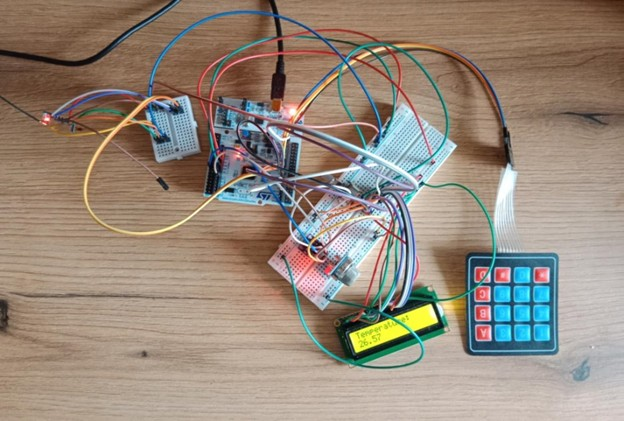
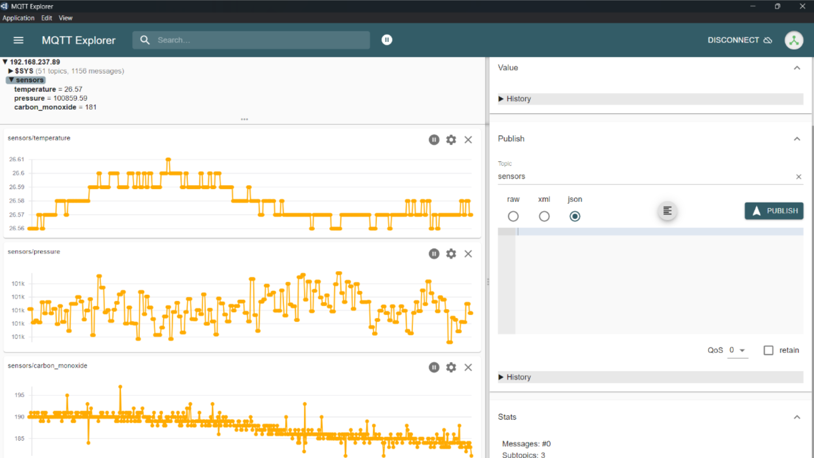

# Mini-station-for-measuring-the-environment

The station reads the data from two sensors about the information of environment. Then the data is presented on LCD display and additionally they are sent to MQTT broker. All infromation is read simultaneously thanks to FreeRTOS.

There is presneted received data in real time.

